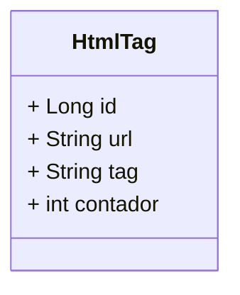

[](https://github.com/lucarauj/Teste-pratico/blob/main/LICENSE)

# Teste prático - Contador de Tags HTML

<br>

## Problema

- No código de uma página HTML há diversas tags para apresentar o conteúdo da melhor forma. 
- Para uma análise mais cautelosa, há o interesse de contabilizar a quantidade de cada tag HTML em uma determinada página.
- É necessário criar um programa para identificar as tags HTML existentes nas páginas que forem carregadas por meio da URL informada. 
- Deve ser contado quantas vezes cada tag aparece em cada página.
- É necessário mostrar as informações coletadas para possibilitar verificar os dados da URL informada. 
- Assim, as URL, tags e as respectivas contagens devem ser armazenadas em um banco de dados.

<br>

## Tecnologias utilizadas

- Java 17
- Maven
- Spring Boot
- PostgreSQL
- Git
- GitHub
- Flyway
- Lombok
- Jsoup
- Thymeleaf
- Postman
- Swagger
- Railway

<br>

## Diagrama de Classe



<br>

## Script para criar tabela no banco de dados

```sql
CREATE TABLE html_tags (
    id SERIAL PRIMARY KEY,
    url VARCHAR(255) NOT NULL,
    tag VARCHAR(50) NOT NULL,
    contador INT NOT NULL
);
```

- Obs.: foi utilizado o Flayway para criar a tabela no banco de dados ao inicializar a aplicação.

<br>

## Swagger

- https://teste-pratico-production.up.railway.app/swagger-ui/index.html#/
- https://teste-pratico-production.up.railway.app/v3/api-docs

<br>

## Validações

- Não permite cadastrar uma URL mais de uma vez;
- Verifica se o endereço é uma URL válida;

<br>

## Exemplo de consulta

```
- https://www.example.com
```

<p align="left"></p>

<br>

# Link da aplicação:

[[CONSULTAR TAGS]](https://teste-pratico-production.up.railway.app/html-tag/formulario)

<br>


## 👨‍🎓 Autor

#### Lucas Araujo

<a href="https://www.linkedin.com/in/lucarauj"></a>

